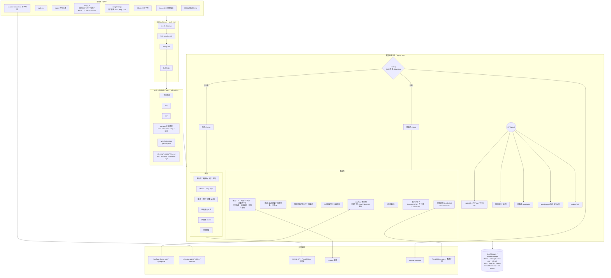
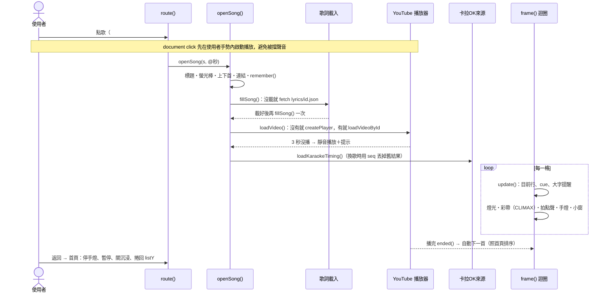

# 網站架構

## 1. 檔案、建置與執行期

```mermaid
flowchart TB
  subgraph SRC["原始檔（版控）"]
    HTML["index.html 版面模板"]
    CSS["style.css"]
    APP["app.js 所有互動"]
    SONGS["songs.js<br/>SONGS・UT・PEN・BEAT・CLIMAX・LIVES"]
    LYR["song-lyrics.js<br/>逐行歌詞 acts・sing・call"]
    I18N["i18n.js 英日字典"]
    KS["karaoke-sources.js 逐字時間"]
    LOG["CHANGELOG.md"]
  end

  subgraph CI["GitHub Actions：push main"]
    CHK["check-data.mjs"] --> TK["test-karaoke.mjs"] --> RO["romaji.mjs"] --> BLD["build.mjs"]
  end
  SRC --> CI

  subgraph DIST["dist → GitHub Pages：ado.kuti.cc"]
    Z["/ 中文首頁"]
    EN["/en/"]
    JP["/jp/"]
    SP["song/id/ 三種語言<br/>base href・data-song・SEO"]
    LJ["lyrics/index.json<br/>lyrics/id.json"]
    MISC["sitemap・robots・llms.txt<br/>404・CNAME・i18n/en.js ja.js"]
  end
  BLD --> DIST

  subgraph RT["瀏覽器執行期：app.js SPA"]
    ROUTE{"route()<br/>#id@秒 或 data-song"}
    HOME["首頁 #home"]
    SONG["歌曲頁 #song"]
    ROUTE -- 沒有歌 --> HOME
    ROUTE -- 有歌 --> SONG

    subgraph H["首頁"]
      CRATE["唱片架：隨機抽、飛行轉場"]
      SEARCH["搜尋 q／barQ 同步"]
      FILTER["篩選・排序・再看 12 首"]
      SHELF["推薦練習 6 首"]
      RESUME["繼續練 recent"]
      FAQ["常見問題"]
    end
    HOME --- H

    subgraph S["歌曲頁"]
      YT["YouTube 播放器<br/>只建一次，loadVideoById 換片"]
      LINES["歌詞：點句跳轉・自動捲動・卡拉OK"]
      CUE["現在要做的事＋下一個動作"]
      ALERT["大字提醒字卡＋邊框光"]
      TOOLS["練習工具：速度・拍點聲・自動下一首<br/>分享時間・回報錯誤・加到主畫面"]
      IMM["沉浸模式 F"]
      PIP["歌詞小窗 P<br/>Document PiP，不行改 Canvas PiP"]
      LAMP["手燈連動 WebSocket<br/>127.0.0.1:51730"]
    end
    SONG --- S

    LOOP(("rAF frame()"))
    LOOP --> UPD["update()：行・cue・卡拉OK"]
    LOOP --> FX["舞台燈光・彩帶"]
    LOOP --> CLK["拍點聲 WebAudio"]
    LOOP --> LF["lampFrame() 每秒最多 5 則"]
    LOOP --> UP["updatePip()"]
  end
  DIST --> RT

  subgraph EXT["外部服務"]
    YTAPI["YouTube iframe_api・i.ytimg.com"]
    KAPI["lyrics.txw.qzz.io・AMLL・LRCLIB"]
    GH["GitHub API：PenlightSync 最新版"]
    GF["Google 表單"]
    GA["Google Analytics"]
    PS["PenlightSync App → 藍牙手燈"]
  end
  YT <--> YTAPI
  KS --> KAPI
  LAMP <--> PS
  TOOLS --> GF
  ROUTE --> GA
  H --> GH

  ST[("localStorage／sessionStorage<br/>theme・view-opts・mv-rate・list-sort<br/>tool-*・alert-off・recent<br/>install-dismissed・list-shown")]
  RT <--> ST
```

## 2. 打開一首歌的流程

```mermaid
sequenceDiagram
  actor U as 使用者
  participant R as route()
  participant O as openSong()
  participant L as 歌詞載入
  participant P as YouTube 播放器
  participant K as 卡拉OK來源
  participant F as frame() 迴圈

  U->>R: 點歌（#id）或打開 song/id/
  Note over U,P: document click 先在使用者手勢內啟動播放，避免被擋聲音
  R->>O: openSong(s, @秒)
  O->>O: 標題・螢光棒・上下首・連結・remember()
  O->>L: fillSong()：沒載就 fetch lyrics/id.json
  L-->>O: 載好後再 fillSong() 一次
  O->>P: loadVideo()：沒有就 createPlayer，有就 loadVideoById
  P-->>O: 3 秒沒播 → 靜音播放＋提示
  O->>K: loadKaraokeTiming()（換歌時用 seq 丟掉舊結果）
  loop 每一格
    F->>F: update()：目前行、cue、大字提醒
    F->>F: 燈光・彩帶（CLIMAX）・拍點聲・手燈・小窗
  end
  P-->>F: 播完 ended() → 自動下一首（照首頁排序）
  U->>R: 返回 → 首頁：停手燈、暫停、關沉浸、捲回 listY
```
